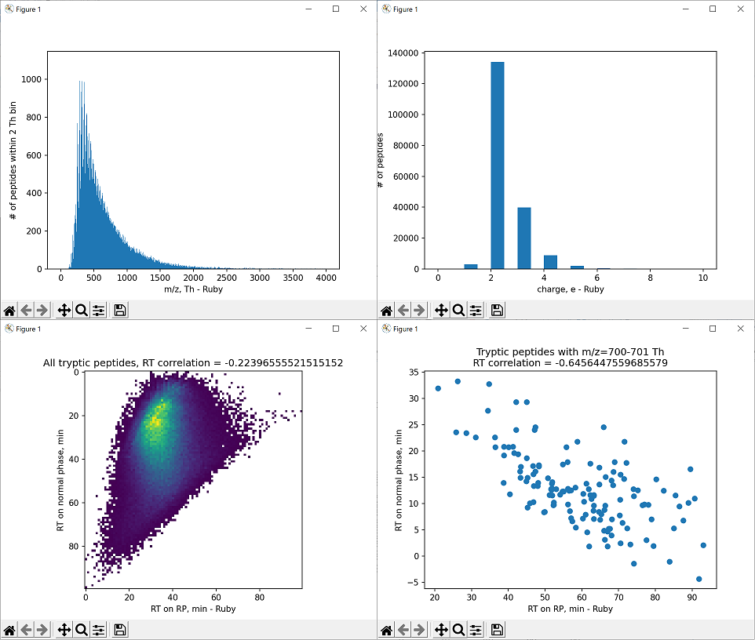

# proteomics
[Pyteomics](https://pyteomics.readthedocs.io/en/latest/) ***v4.5*** の `Ruby` 版を目指します。
（仮リポジトリ）

from python 3.7 to ruby 2.7

# Special thanks
[jPOST - Japan Proteome Standard Repository/Database -](https://jpostdb.org/)

Prof. K
# remainder
Exam3 (and many kinds of XML)
# todo
+ respond ruby 3.1
+ introduce numo-narray
+ substitude matplotlib
# gem
次のgemが必要です。
```ruby
gem "bio"
gem "pandas"
gem "matplotlib"
```
`fasta` 形式は `bioruby` を利用しています。
その他のファイル形式についての実装を計画中です。

https://rubygems.org/gems/bio

`pandas`を指定すると`pycall`や`numpy`がインストールされます。

https://rubygems.org/gems/pandas

https://rubygems.org/gems/matplotlib

# 成果物
本リポジトリを元に、ブラウザ上でグラフ表示するリポジトリを作成いたしました。

https://github.com/superrino130/spectra_viewer

https://spectraviewer.herokuapp.com/


# EXAM
## EXAM 1
[EXAMPLE 1: UNRAVELLING THE PEPTIDOME - Pyteomics](https://pyteomics.readthedocs.io/en/latest/examples/example_fasta.html)

source: [exam1.rb](./exam1.rb)


## EXAM 2
[EXAMPLE 2: Fragmentation - Pyteomics](https://pyteomics.readthedocs.io/en/latest/examples/example_msms.html)


# テスト進捗（完了他）
+ test_electrochem.rb
+ test_parser.rb
+ test_mass.rb(残り2)
+ test_auxiliary_fdr
+ test_auxiliary_offsetindex
+ test_auxiliary_regression
+ test_auxiliary_useindex
+ test_auxiliary_version
